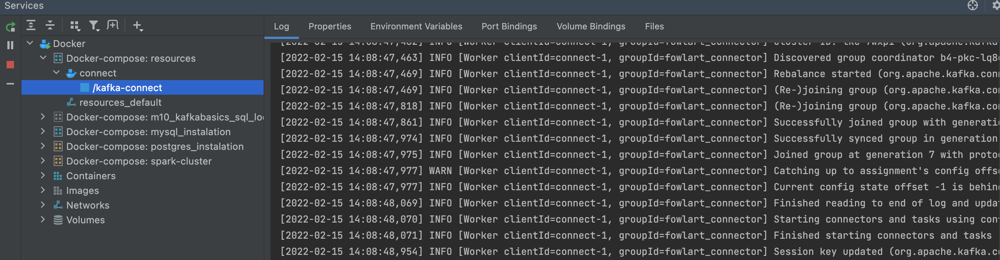
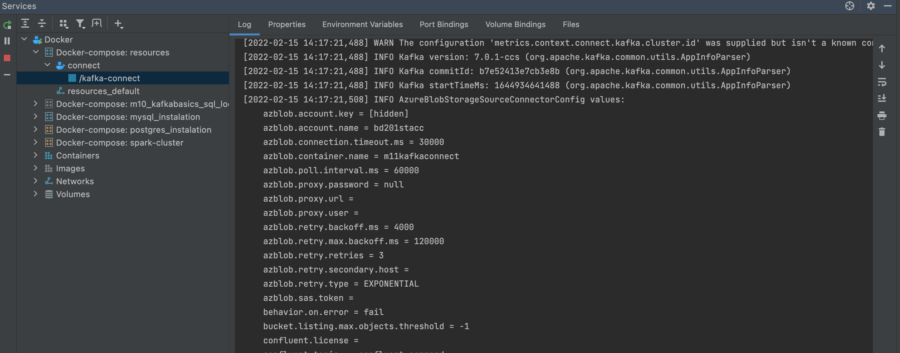
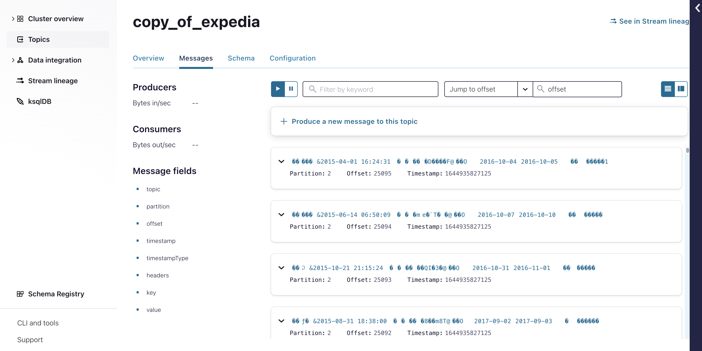

# Kafka connect

1. Created **docker-compose-kafka-connect.yml** for the 
provisioning Kafka connector locally. 

`docker-compose-kafka-connect.yml up -d`

**result:**

2. Created and executed **AzureRESTConnectorStarter.java** for configuring actual
   azure-blob-storage-source connector via REST

**result:**

3. Check Kafka on the cloud if data is streamed from azure blob store

**result:**

